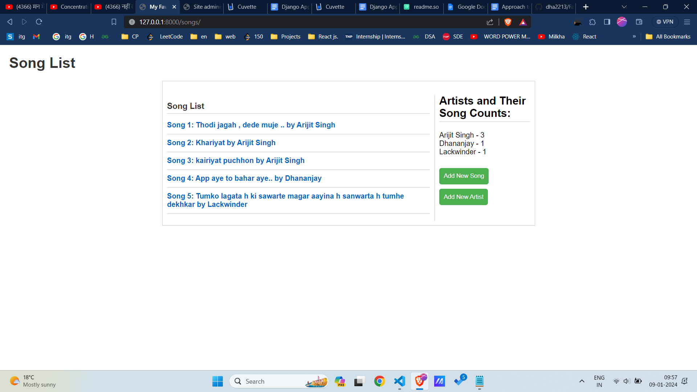
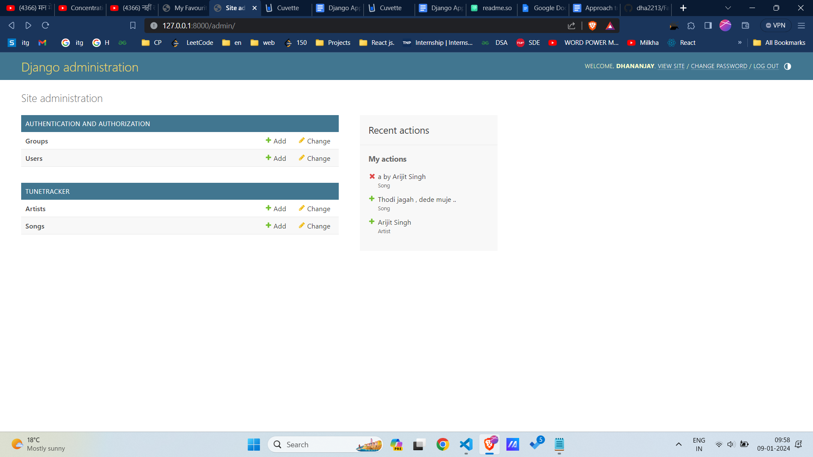

# My Favorite Tunes Project



# Admin Page



# TuneTracker

TuneTracker is a web application that allows users to manage and track their favorite tunes. Users can view a list of songs, details about each song, and manage artists. Additionally, the application provides statistics on song counts for each artist.

## Features

- **Song List:** View a list of songs with details about each song, including the artist's name.

- **Artist Statistics:** See the count of songs for each artist.

- **Add New Song and Artist:** Easily add new songs and artists to the database.
## Installation

1. Clone the repository:

    ```bash
    git clone https://github.com/your-username/TuneTracker.git
    ```


2. Apply database migrations:

    ```bash
    python manage.py migrate
    ```

3. Run the development server:

    ```bash
    python manage.py runserver
    ```

5. Access the application at `http://127.0.0.1:8000/` in your web browser.
## Usage/Examples

1. Visit the home page to see the song list, artist statistics, and buttons to add new songs or artists.

2. Click on a song to view more details.

3. Use the "Add New Song" and "Add New Artist" buttons to contribute to the database.

## Contributing

 
Contributions are welcome! If you'd like to contribute to TuneTracker, please follow these steps:

1. Fork the repository.

2. Create a new branch for your feature or bug fix:

    ```bash
    git checkout -b feature-name
    ```

3. Make your changes and commit them:

    ```bash
    git commit -m "Your detailed commit message"
    ```

4. Push your changes to your fork:

    ```bash
    git push origin feature-name
    ```

5. Open a pull request on the original repository.

## License
@dhananjayyadav221303@gmail.com

## 🔗 Links
[](https://www.linkedin.com/in/iamdhananjay/) 
